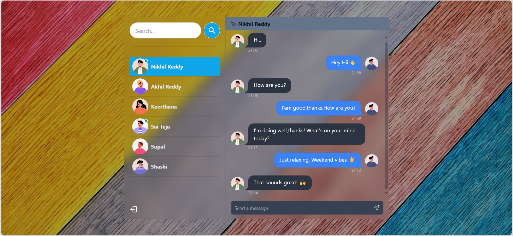

# MERN Stack Project: Real-Time Chat App



You can view the live demo of this Chat App at [Live-demo-link](https://chat-app-1g5w.onrender.com/).

## Features

- 🌟 **Tech stack**: MERN + Redux Toolkit + Socket.io + TailwindCSS + Daisy UI
- 🔒 **Password encryption** with bcrypt
- 🛡️ **Authentication & Authorization** with JWT
- 💬 **Real-time messaging** with Socket.io
- 🟢 **Online user status & notifications** (Socket.io and Redux Toolkit)
- 🐞 **Error handling** both on the server and on the client
- ⏳ And much more!

### Setup .env file

```bash
PORT=...
MONGO_URI=...
SECRET_KEY=...
NODE_ENV=...
```

### Build the app

```shell
npm run build
```

### Start the app

```shell
npm start
```
